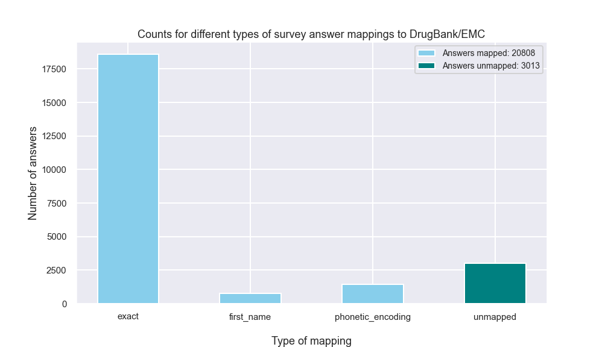
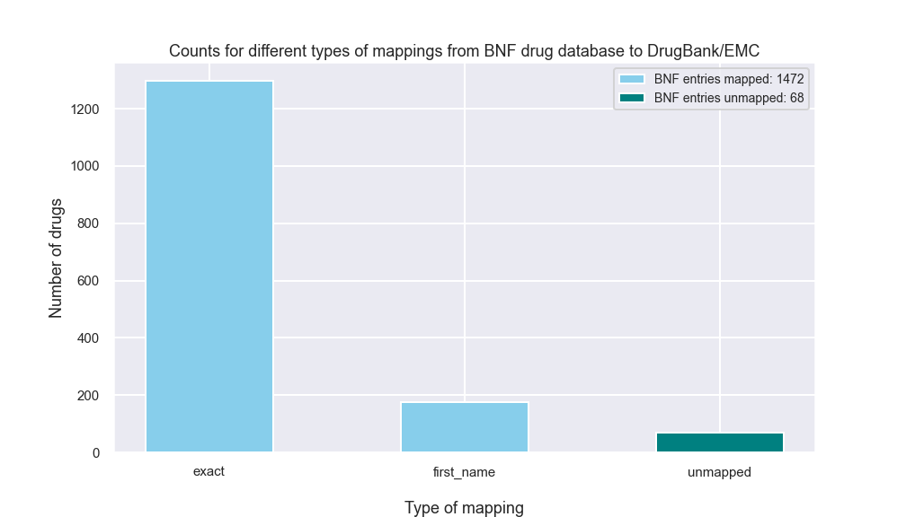

# COVIDENCE UK study 

[COVIDENCE](https://www.qmul.ac.uk/covidence/) is a COVID-19 UK national study being conducted by researchers at Queen Mary University of London,
King's College London, University of Edinburgh, Swansea University, Queen's University Belfast, and the London School of Hygiene and Tropical Medicine.
The first part of the study follows a cohort of approximately 10,000 UK residents with monthly surveys related to lifestyle, 
physical wellbeing, and mental health. If you are interested in participating, please follow the link above. For any specific inquiries
about the study please contact Chief Investigator Adrian Martineau (a.martineau@qmul.ac.uk) or Principal Investigator Hayley Holt (h.holt@qmul.ac.uk).

This is a repository containing Python scripts for cleaning, transforming, and the mapping answers from the survey to patient features
that will be statistically analysed in the study. We hope to identify what types of patients are more or less likely to contract COVID-19.

**Due to privacy considerations, no patient-level data is included in this repository**. 
However, we do include multiple data sets generated from scripts that automatically pull data from public internet resources (e.g. the BNF). 
Most scripts can be run without the patient-level data.

## Objectives

1. The primary objective of this workflow is to annotate individual survey respondents with different classes of drugs based 
on the medications they listed in their survey answers. By annotating patients with drug classes rather than individual medications, 
this study can achieve sufficient statistical power to infer whether different types of medicine are associated with patients 
developing COVID-19.

2. A secondary objective involves calculating [Indices of Multiple Deprivation](https://www.gov.uk/government/statistics/english-indices-of-deprivation-2019)
using the postcodes that respondents provided to the survey. Here, we hope to ascertain whether certain socio-economic factors
are associated with patients developing COVID-19.

## Dependencies

This pipeline requires the following packages:
- bs4==4.9.1
- pandas==1.1.0
- abydos==0.5.0
- numpy==1.19.1

## 1) Medication data

### DrugBank

We use data from the [DrugBank](https://www.drugbank.ca/)
database as a list of drug names mapped to standard identifiers for active ingredients. 
DrugBank kindly makes their entire database available as an XML file to users who sign up, request a download, and specify the data will be used. 
However, because these data are not publicly available, they have been omitted from this repository. 
Users can request a download [here](https://www.drugbank.ca/releases/latest). 
In order to reproduce this workflow, the downloaded XML file should be named `drugbank.xml` and moved to the `/data` directory.

To parse the XML file and map drug aliases to the IDs of their standard identifiers, we provide the [`Parse_drugbank.py`](Parse_drugbank.py) script,
which returns a dictionary - `drug_dictionary` - containing medication names as keys mapped to the DrugBank IDs of their active ingredients.

### Electronic Medicines Compendium (EMC)

Because DrugBank is a North American organisation, the database does not include the names of certain European medications. 
To fill these gaps, we provide the [`Get_EMC_drugs.py`](Get_EMC_drugs.py) script, which imports the drug dictionary from [`Parse_drugbank.py`](Parse_drugbank.py):

``` python
# get the DrugBank drug dictionary
from Parse_drugbank import drug_dictionary
```

and scans the [EMC drug list](https://www.medicines.org.uk/emc/browse-medicines) to identify medications listed on the EMC that are not present in the drug dictionary.
The script pulls the active ingredients of these missing medications and adds an entry to the drug dictionary for each medication name, mapping it to the IDs
of its active ingredients. This generates an updated version of the drug dictionary that contains aliases from both the 
EMC and DrugBank. This updated file is saved as a pickle file under `/data/drug_dictionary.p`. This file is included in the repository.

To reproduce the workflow, simply run via the command line from the repository:

``` 
python Get_EMC_drugs.py
```

### Mapping medications from survey respondents

The survey responses listing each participant's medication(s) were collected as a CSV file (not included). 
Overall, 23,821 medications were provided across 6,624 respondents who provided at least one medication each.

We provide the [`Map_survey_answers.py`](Map_survey_answers.py) script for cleaning and mapping the survey responses to aliases in the drug dictionary. 
First, the survey answer CSV file and the DrugBank/EMC drug dictionary are read-in:

``` python
# import the drug dictionary
drug_dictionary = pickle.load(open('data/drug_dictionary.p', 'rb'))

# import the survey data
survey_data = pd.read_csv('data/Covidence_12Aug20_DrgExtra.csv')
```

Then, the survey answers are processed using regular expressions to remove text related to dosages, frequencies, and routes of administration from 
the raw text. Then, the processed answers are scanned for those which match keys in the drug dictionary. 
For the answers that are not present in the drug dictionary, we try the first word only:

``` python
import re
...
# regex pattern to isolate first word
first_word = re.sub('[^\w]+.*$', '', answer)
```

We then try a phonetic encoding for the remaining unmapped answers, to identify misspelled names in the answers that are phonetically-identical to aliases in the drug dictionary.
The [abydos implementation](https://abydos.readthedocs.io/en/latest/abydos.phonetic.html#abydos.phonetic.Metaphone) of the [Metaphone](https://en.wikipedia.org/wiki/Metaphone)
algorithm was applied to generate phonetic encodings of the answer list and drug dictionary aliases, which were cross-referenced for 
matches.

``` python
from abydos.phonetic import Metaphone
...
mp = Metaphone()
...
# get survey answers whose encodings are valid
mapped_by_encoding = [answer for answer in unmapped_survey_answers if mp.encode(answer) in encoded_drug_dict]

# add answers to the drug dictionary under the encoding's drugbank ids
for answer in mapped_by_encoding:
    drug_dictionary[answer] = encoded_drug_dict[mp.encode(answer)]
```

Finally, the script returns a list of answers that could not be mapped using any of the methods detailed above.

``` python
# list for drugs still unmapped by phonetic encoding
unmapped_by_encoding = [answer for answer in unmapped_survey_answers if answer not in mapped_by_encoding]
```

In our data set this was approximately 3,000 answers (12.5%).



### Mapping misspelled answers

For the remaining 3,000 answers, we provide the [`Map_by_LV_distance.py`](Map_by_LV_distance.py) script, which scans the drug dictionary for aliases 
that are a Levenshtein distance of 1 unit away from each answer, in order to identify the closest match for each. 
We use the [abydos implementation of Levenshtein distance](https://abydos.readthedocs.io/en/latest/abydos.distance.html#abydos.distance.Levenshtein) for 
the distance calculations. For answers with more than one alias
with a distance of 1, we take the alias with the active ingredients appearing at the highest frequency in the rest of the survey answers:

``` python
# get matches that are a distance of 1 away
matches = [alias for alias, distance in distances.items() if distance == 1]

# if there are multiple matches that are a distance of 1 away, take the one that appears at the highest frequency
if matches:
    best_match = max(matches, key = lambda alias: np.mean([drug_frequencies[db_id] for db_id in drug_dictionary[alias]]))
    mapped_by_lv_distance[answer] = best_match
```

For this final round of mapping, the script should be executed as follows:

```
python Map_by_LV_distance.py
```

The Levenshtein distance-mapped and the remaining unmapped answers (with distance > 1 for all drug dictionary aliases) are outputted 
as a CSV file to `/data/answer_mappings.csv`. The unmapped answers were annotated manually, with the help of four medical students at Queen Mary:

- Sultan Saeed Rajpoot
- Philipa Jane Lloyd
- Sarah El Rifai
- Ahmed Ali Kayyale

We provide the full answer mappings as the file `/data/answer_mappings_complete.csv`, 
containing both the distance-based and manual annotations for the misspelled survey answers.

### Getting BNF classes

To generate data on the [British National Formulary](https://bnf.nice.org.uk/drug/) drug classifications for different medications, we provide the [`Get_BNF_classes.py`](Get_BNF_classes.py) script. 
This script imports the DrugBank/EMC drug dictionary pickle file:

``` python
# import drug dictionary
drug_dictionary = pickle.load(open('data/drug_dictionary.p', 'rb'))
```

and if it is run from the command line:

``` 
python Get_BNF_classes.py
```

it pulls drug class data from the BNF website and saves it in a Pandas DataFrame, with drug names mapped to BNF classes and DrugBank IDs. 
Overall, 96% of the BNF drug entries were mapped to active ingredient IDs in the DrugBank dictionary.



The BNF DataFrame is then converted into a CSV file and saved:

``` python
bnf_classes.to_csv('data/bnf_drug_classifications.csv', index_label='entry')
```

We include this file in the repository, under the path shown above.

### Annotating patients with BNF drug classes

To annotate individual patients in the survey with the BNF drug classes being investigated, we provide the [`Annotate_patients.py`](Annotate_patients.py) script.
Each patient is annotated with more than 20 BNF drug classes to be analysed as covariates, with each covariate taking a value of 1 if the patient listed medications from that class and 0 if not.
Some examples of classes being investigated include:

- Statins
- ACE inhibitors
- Proton pump inhibitors
- Corticosteroids

This script first imports the csv file `/data/bnf_drug_classifications.csv`, which contains the BNF class data:

``` python
# import bnf class dataframe
bnf_classes = pd.read_csv('data/bnf_drug_classifications.csv')
```

and then imports the manual answer corrections file `/data/answer_mappings_complete.csv`:

``` python
# load in unmapped answers and map to the drug dictionary
corrections = pd.read_csv('data/answer_mappings_complete.csv')
```

The manual corrections are added to the drug dictionary, and each patient is labelled for each drug class. 
The script outputs a CSV file (not included) containing the patient-level information for each drug class.

## 2) Postcode data

### Mapping postcodes to Index of Multiple Deprivation (IMD)

We also provide the [`Map_IMD_data.py`](Map_IMD_data.py) script for mapping the patient postcodes provided to the survey (not included) to values of the [Index of Multiple Deprivation](https://www.gov.uk/government/statistics/english-indices-of-deprivation-2019) (IMD).
This script first imports a postcode metadata set (not included due to size constraints) - `/data/postcode_data.csv` - obtained from [this](https://www.doogal.co.uk/ukpostcodes.php) website.

It then imports the excel spreadsheet `/data/UK_postcode_IMDs.xlsx` (included), which contains postcode-IMD pairs in for postcodes in England, Wales, and Scotland: 

``` python
england_imd_data = pd.read_excel('data/UK_postcode_IMDs.xlsx', sheet_name = 'english_postcode_IMDs')
...
scotland_imd_data = pd.read_excel('data/UK_postcode_IMDs.xlsx', sheet_name = 'scottish_postcode_IMDs')
...
welsh_imd_data = pd.read_excel('data/UK_postcode_IMDs.xlsx', sheet_name = 'welsh_postcode_IMDs')
```

and maps the respondent postcodes to IMD deciles and ranks. 
For Northern Irish postcodes, we use urllib and Beautiful Soup to input the respondent postcodes into the [web API](https://deprivation.nisra.gov.uk/) provided by the Northern Irish government and save the resulting output.

The patient mappings to IMD ranks and deciles are saved as a CSV file (not included in this repository).